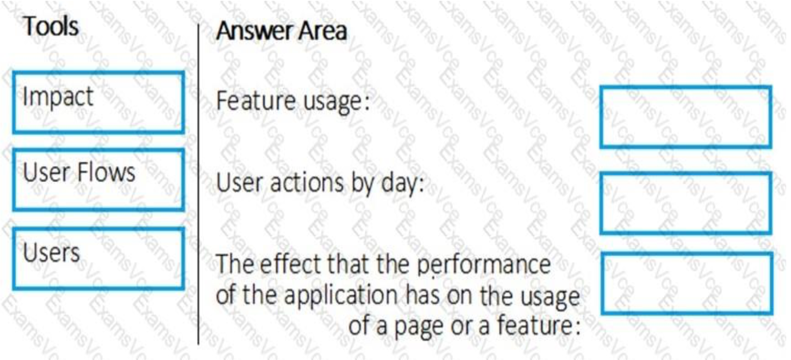
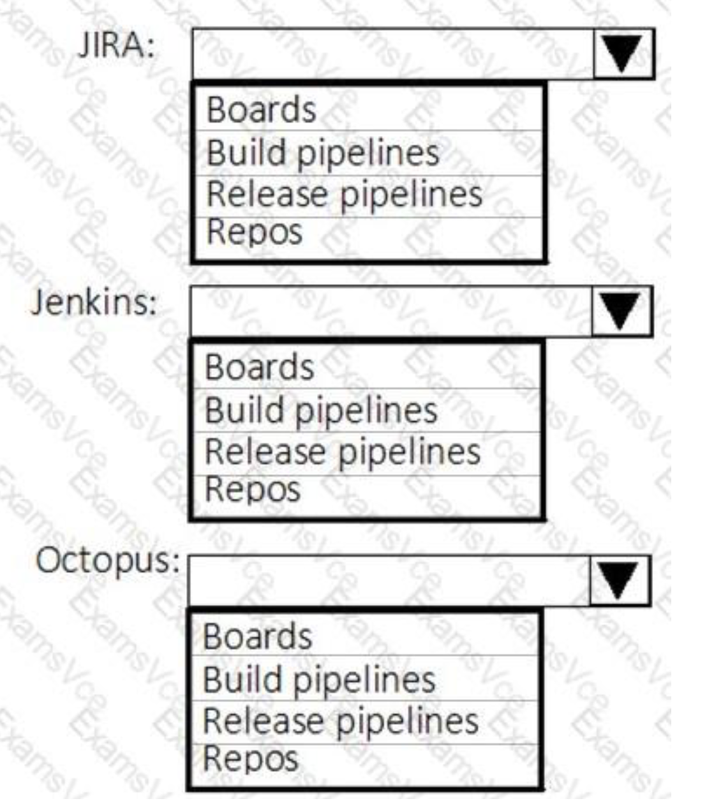
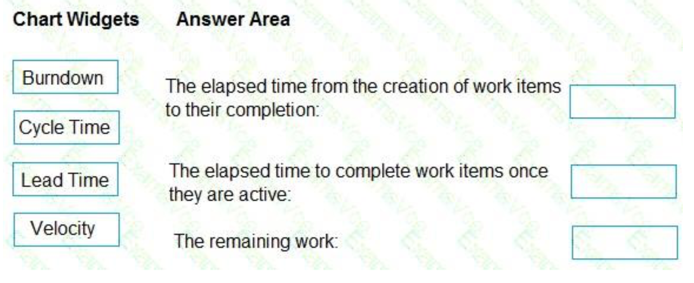
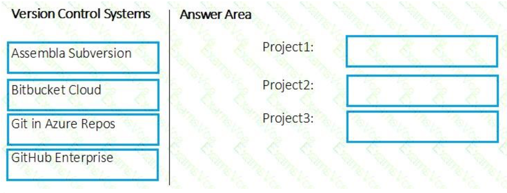
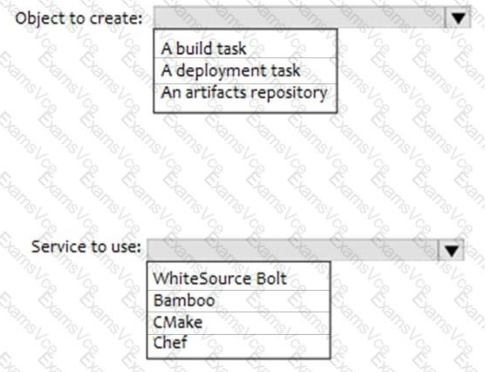

# AZ-400

## Case 1

- 1

- 2

- 3

- 4

- 5

## Case 2

- 1

`3`

- 2

`3`

- 3

`3`

- 4

`3`

- 5

- 6

`3`

## Choise

- 1

- 2

- 3

`3`

- 4

- 5

- 6

- 7

`3`

- 8

- 9

- 10

- 11

- 12

- 13

- 14

- 15

- 16

- 17

- 18

- 19

- 20

- 21

- 22

- 23

`3`

- 24

`5`

- 25

`4`

- 26

- 27

- 28

`4`

- 29

- 30

`3`

- 31

- 32

